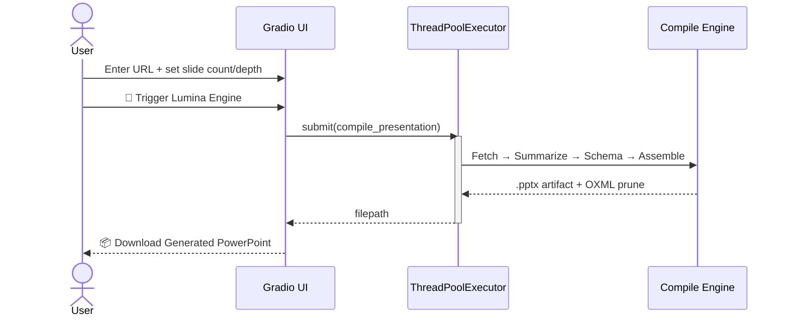
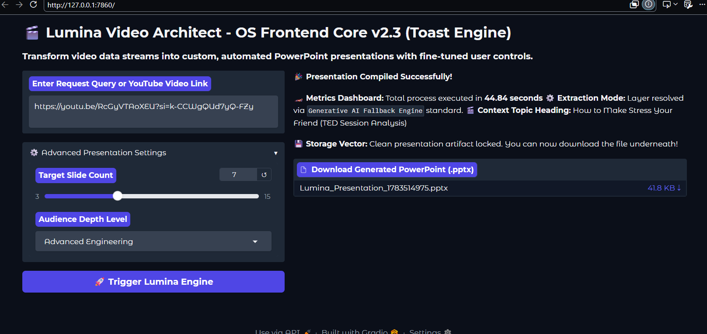

<div align="center">


# 🔮 &nbsp;L U M I N A&nbsp; V I D E O &nbsp;A R C H I T E C T
### `OS Frontend Core v2.3` · *Toast Engine*


<br>

<a href="#">
  
</a>

<br>

[](.)
[](.)
[](.)
[](.)
[](.)

<br>

[](.)
[](.)
[](.)

<br>

<sub>🧵 THREAD-SAFE &nbsp;·&nbsp; 🧹 ZERO-LEAK &nbsp;·&nbsp; 🛡️ SECRET-MASKED &nbsp;·&nbsp; ⚡ 44.84s AVG COMPILE &nbsp;·&nbsp; 🗂️ 7-SLIDE MATRIX</sub>

</div>

<br>

<table align="center" width="100%">
<tr>
<td align="center" width="25%">

### 🧵
**Thread-Safe**
`ThreadPoolExecutor(4)`

</td>
<td align="center" width="25%">

### 🧹
**Zero-Leak**
`OXML Tree Pruning`

</td>
<td align="center" width="25%">

### 🛡️
**Secret Masking**
`Log Interceptor`

</td>
<td align="center" width="25%">

### ⚡
**Fast Compile**
`44.84s avg.`

</td>
</tr>
</table>

<br>

<div align="center">

### 🗺️ Compilation Pipeline


</div>

<br>

<div align="center">

### 🎞️ Request Lifecycle



</div>

---

## 📑 Table of Contents

<div align="center">

📸 [Workspace Preview](#-production-workspace-preview) &nbsp;•&nbsp;
⚙️ [Engineering Pillars](#️-system-core-engineering-pillars) &nbsp;•&nbsp;
📊 [Output Showcase](#-sample-output-showcase) &nbsp;•&nbsp;
📂 [Slide Payload](#-generated-presentation-payload--7-slide-corporate-matrix) &nbsp;•&nbsp;
🗺️ [Roadmap](#️-roadmap) &nbsp;•&nbsp;
🚀 [Quick Start](#-local-runtime-initialization)

</div>

---

## 📸 Production Workspace Preview

<div align="center">



*Live desktop capture — request submitted, engine triggered, artifact compiled.*

</div>

<table>
<tr>
<td width="33%" valign="top">

### 🎚️ Target Slide Count
Slider-driven range (**3–15**) that governs how aggressively the summarizer compresses source content into deck length.

</td>
<td width="33%" valign="top">

### 🧠 Audience Depth
Dropdown control (e.g. *Advanced Engineering*) that reshapes tone and technical density of every generated bullet.

</td>
<td width="33%" valign="top">

### 📟 Async Stream Terminal
Live pipeline telemetry — fetch → summarize → schema → assemble — streamed without blocking the UI thread.

</td>
</tr>
</table>

A single **`🚀 Trigger Lumina Engine`** action fires the backend compile job and returns a downloadable `.pptx` artifact on completion.

---

## 🖥️ Interactive Demo

<div align="center">

**[▶ Open the interactive mockup](./lumina_interface.html)**

*Clone the repo and open `lumina_interface.html` in any browser — drag the slide-count slider, pick an audience depth, and click Trigger Lumina Engine to watch a simulated 4-phase compile run through to a mock download.*

</div>

> **Note:** GitHub strips `<script>` tags from rendered Markdown, so this can't run live inline on this page — it has to be opened as its own file. If you'd rather see it without cloning anything, host it via **GitHub Pages** (Settings → Pages → deploy from a branch containing `demo/`) and swap the link above for the live Pages URL.


https://github.com/user-attachments/assets/fbad855d-f65e-4c2a-9cc6-c2479d7097a8


---

## ⚙️ System Core Engineering Pillars

<table>
<tr>
<td width="34" align="center">🧵</td>
<td>

**Decoupled Task Offloading**
A persistent `ThreadPoolExecutor(max_workers=4)` isolates heavy binary processing — video fetch, transcript parsing, slide assembly — away from the client-facing event loop, keeping the UI fluid while compilation runs in the background.

</td>
</tr>
<tr>
<td align="center">🧹</td>
<td>

**Memory Leak Auditing & OXML Tree Pruning**
On job completion, sub-level OpenXML elements are explicitly cleared via `shapes._spTree.clear()`, followed by a manual `gc.collect()` cycle to deallocate unreachable cyclic node references left behind by `python-pptx` object graphs.

</td>
</tr>
<tr>
<td align="center">🛡️</td>
<td>

**Secure Sandbox Log Masking**
A transparent `sys.stdout` interceptor, wrapped around structured regular expressions, filters real-time telemetry logs and replaces any live credentials with `[SECURE_MASK_LOCKED]` before they reach the terminal or log file.

</td>
</tr>
</table>

---

## 📊 Sample Output Showcase

<div align="center">

### 🎬 Production Run — "How to Make Stress Your Friend"

| Field | Value |
|:--|:--|
| 🔗 **Input Query URL** | `youtu.be/RcGyVTAoXEU` |
| 🧭 **Context Topic** | How to Make Stress Your Friend *(TED Session Analysis)* |
| ⚙️ **Execution Mode** | Generative AI Fallback Engine *(upstream scraper firewall restrictions)* |
| ⏱️ **Total Process Time** | **44.84 seconds** |
| ♻️ **Cyclic Memory Nodes Flushed** | **15,967** unreachable references |

</div>

<div align="center">

**⏳ Performance Profiler — Phase Latency**

| Phase | Task | Duration | |
|:--|:--|:--:|:--|
| 1 | Fetch | `25.12s` | ████████████████████████░░░░░░░░░░░░░░ 56% |
| 2 | Summary | `10.10s` | ██████████░░░░░░░░░░░░░░░░░░░░░░░░░░░░ 23% |
| 3 | Schema | `9.40s` | █████████░░░░░░░░░░░░░░░░░░░░░░░░░░░░░ 21% |
| 4 | Assembly | `0.20s` | ░░░░░░░░░░░░░░░░░░░░░░░░░░░░░░░░░░░░░░ <1% |
| **Σ** | **Total** | **`44.84s`** | **100%** |

</div>

---

## 📂 Generated Presentation Payload — 7-Slide Corporate Matrix

Each slide follows a **Three-Zone Layout Alignment Grid**: Zone 1 (visual context) · Zone 2 (Column A) · Zone 3 (Column B).

<details>
<summary>🟣 <strong>Slide 01 — Executive Overview: Reframing Stress</strong></summary>
<br>

> **Zone 1 —** `EXECUTIVE OVERVIEW: REFRAMING STRESS`

| Zone 2 | Zone 3 |
|:--|:--|
| Stress is often misperceived as purely negative, hindering growth and connection. | Strategic shift from stress avoidance to leveraging its biological responses. |
| Scientific analysis redefines stress as a potential catalyst for positive outcomes. | Cognitive reframing and active social engagement are key to harnessing stress. |

</details>

<details>
<summary>🟣 <strong>Slide 02 — Core Pillars of Stress Transformation</strong></summary>
<br>

> **Zone 1 —** `CORE PILLARS OF STRESS TRANSFORMATION`

| Zone 2 | Zone 3 |
|:--|:--|
| This section outlines fundamental concepts for understanding and managing stress effectively. | Highlights the critical role of human connection in stress mitigation and thriving. |
| Focus on stress reframe, cognitive appraisal, psychological resilience, and oxytocin dynamics. | Provides a structured approach to leveraging stress for personal and collective benefit. |

</details>

<details>
<summary>🟣 <strong>Slide 03 — Stress Reframe: Challenge vs. Threat Response</strong></summary>
<br>

> **Zone 1 —** `STRESS REFRAME: CHALLENGE VS. THREAT RESPONSE`

| Zone 2 | Zone 3 |
|:--|:--|
| View stress not as debilitating, but as the body's natural physiological response to challenge. | Promote a 'challenge response' for increased cardiovascular efficiency and enhanced focus. |
| Shift from outright stress elimination to consciously utilizing adaptive responses. | Avoid the 'threat response' characterized by fear and physiological constriction for better performance. |

</details>

<details>
<summary>🟣 <strong>Slide 04 — Cognitive Appraisal Theory: Interpreting Stressors</strong></summary>
<br>

> **Zone 1 —** `COGNITIVE APPRAISAL THEORY: INTERPRETING STRESSORS`

| Zone 2 | Zone 3 |
|:--|:--|
| This theory is central to understanding the individual stress response mechanism. | Appraise situations as manageable challenges versus overwhelming threats for better outcomes. |
| The interpretation or 'appraisal' of a stressor critically dictates subsequent outcomes. | Fosters a proactive mindset in managing perceptions of demanding situations to cultivate beneficial responses. |

</details>

<details>
<summary>🟣 <strong>Slide 05 — Building Psychological Resilience</strong></summary>
<br>

> **Zone 1 —** `BUILDING PSYCHOLOGICAL RESILIENCE`

| Zone 2 | Zone 3 |
|:--|:--|
| Resilience explores the innate human capacity to adapt, recover, and even thrive amidst adversity. | Actively built through developing self-efficacy and practicing emotional regulation techniques. |
| Linked to the successful activation of a 'challenge response' and effective coping strategies. | Leveraging robust social support systems is crucial for fostering resilience, not an absence of stress. |

</details>

<details>
<summary>🟣 <strong>Slide 06 — Oxytocin: The Social Bonding Hormone</strong></summary>
<br>

> **Zone 1 —** `OXYTOCIN: THE SOCIAL BONDING HORMONE`

| Zone 2 | Zone 3 |
|:--|:--|
| Oxytocin plays a crucial role as a neuro-hormone that reduces fear and promotes pro-social behaviors. | Acts as a natural antidote to the typical 'fight-or-flight' response, encouraging 'tend-and-befriend'. |
| Notably released during stressful periods when individuals seek or offer social support and connection. | Aids in healing, fostering courage, and strengthening social connection during times of heightened stress. |

</details>

<details>
<summary>🟣 <strong>Slide 07 — Human Connection & Thriving with Stress</strong></summary>
<br>

> **Zone 1 —** `HUMAN CONNECTION & THRIVING WITH STRESS`

| Zone 2 | Zone 3 |
|:--|:--|
| Active human connection and robust social support networks are critical for effective stress management. | This mechanism, primarily facilitated by oxytocin, significantly enhances individual and collective well-being. |
| Engaging with others, offering help, or seeking connection during stress activates the 'tend and befriend' response. | Reshape our relationship with stress to build profound resilience, foster empathy, and ultimately thrive in life. |

</details>

---

## 🗺️ Roadmap

<div align="center">

| Status | Milestone |
|:---:|:--|
| ✅ | Core 4-phase compile pipeline (fetch → summarize → schema → assemble) |
| ✅ | Thread-offloaded execution via `ThreadPoolExecutor(4)` |
| ✅ | OXML tree pruning + `gc.collect()` memory audit |
| ✅ | Secure log masking for credentials in stdout |
| 🔄 | Streaming phase-by-phase progress in the Async Stream Terminal |
| ⬜ | Template theme picker (multiple corporate color palettes) |
| ⬜ | Batch mode — compile multiple video URLs in one queue |

</div>

---

## 🚀 Local Runtime Initialization

<table>
<tr><td>1️⃣</td><td>

**Activate the virtual environment**
```powershell
.\.env_workspace\Scripts\activate
```

</td></tr>
<tr><td>2️⃣</td><td>

**Install dependencies**
```powershell
pip install -r requirements.txt
```

</td></tr>
<tr><td>3️⃣</td><td>

**Launch the application**
```powershell
python app.py
```

</td></tr>
</table>

The app boots a local Gradio server at `http://127.0.0.1:7860/`, from which the Production Workspace shown above becomes accessible.

---

<div align="center">


**Built with 🔮 Gradio &nbsp;·&nbsp; Powered by the Lumina OS multi-agent architecture**

<sub>© 2026 Lumina OS Project — Anamika Shah</sub>


</div>
